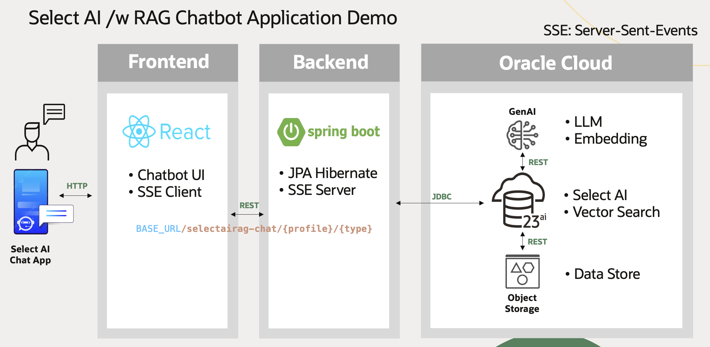
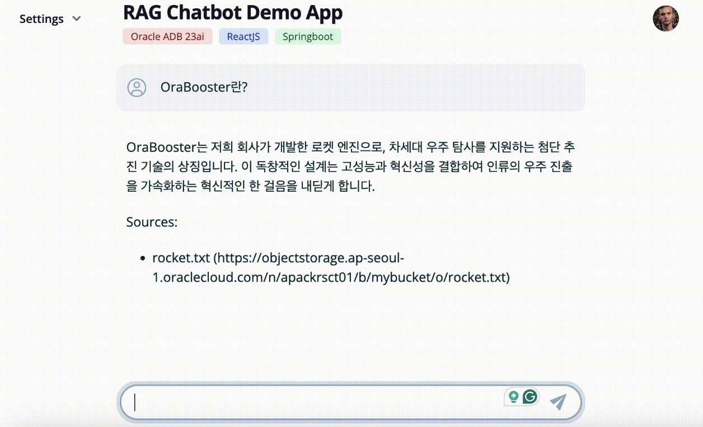

# 23ai Select AI w/ RAG를 활용한 애플리케이션 데모

### 구성도


### User Interface


* Frontend: ReactJS + Tailwind CSS
* Backend: Spring Boot (JPA, SSE: Server Sent Events)

OCI Resource Manager에서 바로 배포하여 테스트해볼 수 있는 스택입니다. (리전 구독 및 리소스 리밋 체크 필요)  
배포 리전: **Seoul**, Default Shape: **VM.Standard.E4.Flex**, Database: **ADB 23ai**  
[](https://cloud.oracle.com/resourcemanager/stacks/create?region=ap-seoul-1&zipUrl=https://github.com/the-team-oasis/genaitf-selectairagappdemo-rm/archive/refs/heads/main.zip)

## Instructions
### Backend
1. 로컬에서 실행 시 Maven 설치 필요합니다. 

2. 소스 다운로드
```
git clone https://github.com/ORCLKRCE-OCI-GEN-AI-TF/selectairag-chatbot-demo.git
```

3. ADB Wallet 설정
아래 예시와 같이 다운로드 받은 ADB Wallet 압축 해제한 디렉토리로 변경합니다.

```
cd src/main/resources
vi application.yaml

url: jdbc:oracle:thin:@myatp23ai_tp?TNS_ADMIN=//Users/dankim/ai-workspace/springboot-selectai-api/src/main/resources/wallet
```

4. 실행
```
cd springboot-selectai-api

mvn spring-boot:run
```

### Frontend
1. 로컬에서 실행 시 Node.js 설치 필요합니다. 

2. 소스 다운로드
```
git clone https://github.com/ORCLKRCE-OCI-GEN-AI-TF/selectairag-chatbot-demo.git
```

3. 실행
```
cd react-selectairag-chatapp

npm run dev
```

